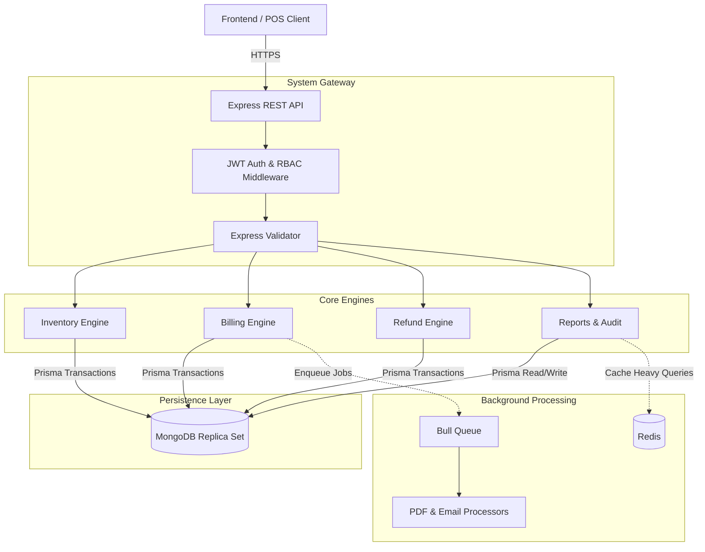
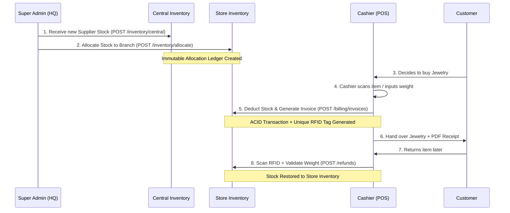

# 💎 Ratna Jewelry Inventory Management System

> A production-grade, highly secure, and centralized backend system designed specifically for scaling jewelry retail chains. It enforces strict multi-tenant data isolation, ACID-compliant ledger transactions, and a robust stone-based pricing model.


---

## 🏗 High-Level Design (HLD) & Architecture

The system is constructed with a highly decoupled, service-oriented architecture. Heavy tasks (like PDF generation and complex aggregations) are offloaded to background worker queues, while strict middleware enforces Data Isolation across all branch stores.



---

## ✨ Comprehensive Feature Implementation

### 1. Stone-Based Inventory Matrix (`RATI` / `CARAT`)
Ratna completely abandons generic gold-weight models in favor of precise, stone-by-stone tracking.
- **Dual Inventory:** Stocks are received into a `Central Inventory` (HQ) and strictly allocated to branch `Store Inventories` via immutable ledger movements.
- **Validation:** Transactions validate available `totalWeight` and `stoneCount` with milligram precision before allowing billing or transfers to proceed.

### 2. Multi-Tenant Role Isolation (RBAC)
A sophisticated `storeId` injection middleware ensures complete data sandboxing between branches.
- **`SUPER_ADMIN` (HQ):** Global read/write operations. Complete oversight, stock allocation, global dashboard insights, and user provision management.
- **`STORE_ADMIN` (Branch Manager):** Can manage their branch's POS flow, monitor localized reporting, and override refunds. They possess read-only rights to the global product catalog.
- **`CASHIER` (POS Operator):** Strictly scoped to their individual `storeId`. Fully empowered to handle day-to-day operations: creating invoices, cancelling erroneous bills, and initiating / managing the refund lifecycle to maximize checkout efficiency.

### 3. POS Billing Engine
Constructed relying exclusively on **ACID Transactions** via MongoDB Replica Sets to prevent ghost stock or partial failures.
- **Dynamic Pricing:** Automatically computes price based on real-time `weight`, `pricePerUnit`, and custom `GST` brackets.
- **Atomic Operations:** Creating an invoice simultaneously removes stock from `StoreInventory`, attaches a `Customer`, generates a unique `InvoiceNumber`, writes a `SALE` entry to the immutable `InventoryLedger`, and fires asynchronous queues for invoice printing.
- **RFID Stamping:** Every line item generated in an invoice generates a mathematically unique `RFID` code, preventing fraudulent returns.

### 4. Automated Refund Lifecycle
The refund system leverages the unique RFIDs attached during billing.
- Cashiers scan the `RFID` to initiate a return.
- If the returned mass precisely matches the sold mass, the item is **Auto-Approved** and stock is immediately restored to the `StoreInventory`.
- Discrepancies generate a `PENDING` state, locking the refund into an immutable queue until manual review is performed.

### 5. High-Performance Dashboard & Audit System
- **Redis Caching:** Global KPI dashboards and 30-day chronological revenue trends are pre-computed by a Bull worker process and cached in Redis with a 5-minute TTL, resulting in sub-10ms response times for executives.
- **Event Audit Logs:** Every critical mutation (Allocation, Billing, Refunds, Store updates) writes an immutable `AuditLog` mapping the specific `userId`, `ipAddress`, and delta JSON.

---

## 🔄 Core System Flow: Lifecycle of a Product



---

## 🛠 Tech Stack & Implementation Details

| Technology | Purpose in System | Implementation Detail |
|------------|----------------|------------------------|
| **Node.js (v20)** | Runtime Engine | Utilizes modern asynchronous architecture for non-blocking I/O. |
| **Express.js** | Routing & APIs | RESTful architecture with heavily segmented route domains. |
| **Prisma ORM** | Data Access | Utilizes `$transaction` blocks to ensure strict ACID compliance across MongoDB documents. |
| **MongoDB** | Persistence | Running as a **Replica Set** strictly to enable multi-document transactions. |
| **Redis** | Speed & Reliability | Backs the `Bull` job queue for PDF invoice processing and acts as an in-memory cache for heavy aggregation queries (Dashboards). |
| **JWT** | Auth & Security | Bearer tokens heavily utilized. The `storeId` is cryptographically embedded into the token to dynamically rewrite queries and prevent IDOR attacks. |
| **Jest / Supertest** | Testing | Full E2E and integration suite running serially (`--runInBand`) to avoid DB deadlocks during transactional stress testing. |

---

## 🚀 Getting Started

### Prerequisites
- Node.js `v20.x` or higher
- Docker & Docker Compose (for spinning up the local replica set)

### 1. Bootstrapping the Environment
```bash
# Clone and install dependencies
git clone <repository-url>
cd jewelry-inventory-backend
npm install

# Setup Environment Files
cp .env.example .env
```

### 2. Infrastructure Initialization
Because MongoDB requires Replica Sets for Prisma Transactions, utilizing Docker is highly recommended.
```bash
# Spins up MongoDB (Configured as Replica Set rs0) and Redis
docker-compose up -d
```

### 3. Database Calibration
```bash
# Generate the Prisma Client tailored to your OS
npm run prisma:generate

# Sync schema and constraints
npm run prisma:migrate

# Seed default Admins, Stores, and Catalog Data
npm run seed
```

### 4. Running the Server
```bash
# Development Mode (Hot-reloading enabled)
npm run dev

# Testing Suite (Run serially to prevent MongoDB lockups)
npm test
```

---

## 📖 Developer References

### API Swagger Documentation
Once the server is running, interactive API documentation is exposed detailing all DTOs and Response Codes:
👉 [http://localhost:3000/api/docs](http://localhost:3000/api/docs)

### Visualizing Data
To inspect database relations dynamically without writing raw Mongo queries:
```bash
npm run prisma:studio
```
👉 [http://localhost:5555](http://localhost:5555)

### Frontend Integration
Refer to `API_DOCUMENTATION.md` in the root repository for specific frontend guides, RBAC breakdowns, and exact payload requirements for crucial routes.
